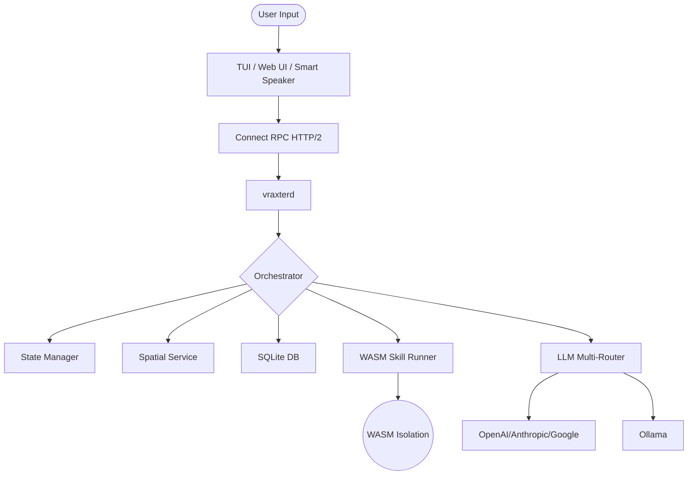

# Vraxter Architecture Guide

Vraxter is engineered as a **distributed, headless autonomous engine** consisting of a persistent background daemon and a high-performance terminal interface.

## System Overview

The system follows a headless Client-Server architecture over **Connect RPC (HTTP/2)**, ensuring that the "brain" (state, memory, execution) remains completely decoupled from any specific frontend (TUI, Svelte web dashboard, or Smart Speaker).

### 1. The Daemon (`vraxterd`)
The daemon is the primary source of truth. It manages:
- **Persistence**: SQLite-backed history, specialists, and model configurations.
- **Environmental Context Engine**: A thread-safe `StateManager` that manages dynamic `ModeConfig` templates (e.g. ambient lighting, music).
- **Orchestration**: The request lifecycle from intent resolution to execution.
- **Skill Runner**: The Wazero-powered WASM sandbox supporting Go, Rust, and Zig.
- **Intelligence**: Model routing and multi-provider coordination.
- **Auth Pipeline**: Scoped-token enforcement and master key dual-authentication.

### 2. The Connect RPC Layer
- **Protobuf-Defined**: Every interaction is type-safe and defined in `api/v1`.
- **Client-Agnostic HTTP/2**: Vraxter transitioned from pure gRPC to Connect RPC, allowing standard web clients (like fetch) to interact seamlessly without proxying.
- **Streaming**: Supports bidirectional streaming for real-time LLM token delivery and tool output updates.

### 3. The Global Event Bus
Vraxter implements a centralized, asynchronous event streaming pipeline. The Event Bus emits standardized events (`SKILL_APPROVAL_REQUEST`, `TOOL_CALL`, system statuses) ensuring all connected clients, regardless of type, can react in real-time to the engine's internal operations without polling.

### 4. Spatial & Identity Concurrency
The engine natively supports serving multiple physical rooms simultaneously.
- **Spatial Isolation**: Requests containing a `source_zone` (e.g. "living_room") instantiate separate conversation memory streams.
- **Unified Device Mapping**: The `SpatialService` merges internal `spatial.json` mapping with Google Home SDK data so the AI knows exactly which speakers (`[Nest Audio, TV]`) exist in which rooms.
- **Voice Recognition**: Requests can pass a `source_user`. The Orchestrator automatically fetches that exact User Profile from the database, instantly hot-swapping the AI's identity context even during concurrent multi-user conversations.

## The Intelligence Pipeline

Every user request goes through the following stages:

### A. Intent Resolution
Vraxter first determines if the input is:
- **Explicit Command**: Starts with `/` (e.g., `/help`, `/start`).
- **Direct Skill Call**: Starts with `!` (e.g., `!vraxter-coder`).
- **Neural Reasoning**: Natural language query requiring the LLM.

### B. Planning (Pro-Mode)
For complex queries, the **Planner** breaks the task into a series of **Phases**. Each phase is an atomic goal assigned to either the main engine or a specific **Specialist**.

### C. Context Assembly
Vraxter dynamically builds a system prompt using:
- **User Profile**: Expertise and interests.
- **Semantic Memory**: RAG-based context from conversation history.
- **Project Structure**: Automated Git context and file tree analysis.
- **Capabilities Matrix**: Listing available tools and active models.

## Data Flow Diagram

