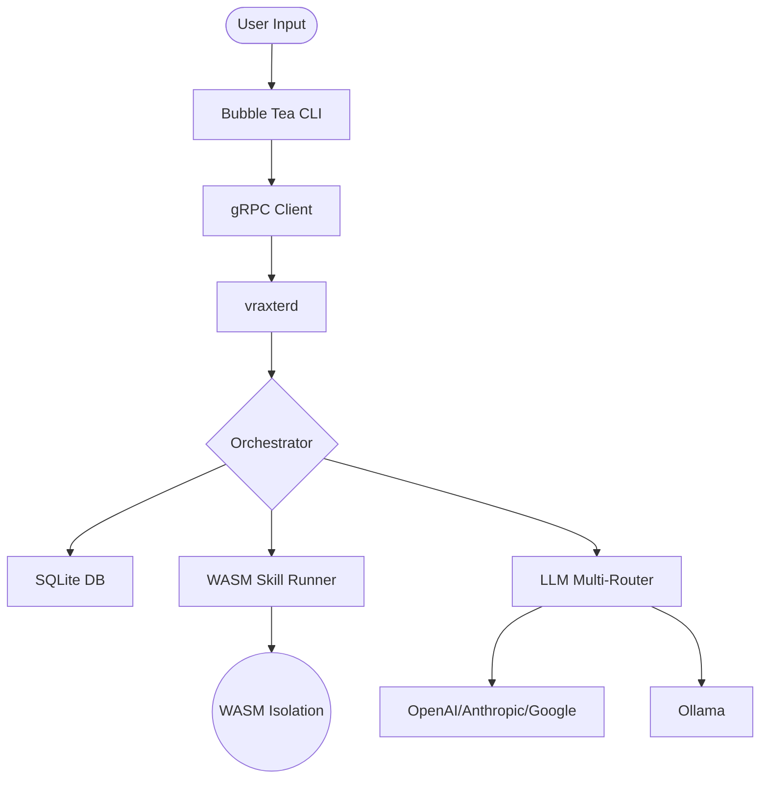

# Vraxter Architecture Guide

Vraxter is engineered as a **distributed, headless autonomous engine** consisting of a persistent background daemon and a high-performance terminal interface.

## System Overview

The system follows a classic Client-Server architecture over **gRPC**, ensuring that the "brain" (state, memory, execution) remains decoupled from the "eyes" (rendering, user input).

### 1. The Daemon (`vraxterd`)
The daemon is the primary source of truth. It manages:
- **Persistence**: SQLite-backed history, specialists, and model configurations.
- **Orchestration**: The request lifecycle from intent resolution to execution.
- **Skill Runner**: The Wazero-powered WASM sandbox.
- **Intelligence**: Model routing and multi-provider coordination.

### 2. The gRPC Layer
- **Protobuf-Defined**: Every interaction is type-safe and defined in `internal/proto`.
- **Streaming**: Supports bidirectional streaming for real-time LLM token delivery and tool output updates.

### 3. The TUI (Bubble Tea)
The terminal interface is a view onto the daemon's state.
- **Fluid Layout**: Uses the Model-View-Update (MVU) pattern for ultra-responsive interface changes.
- **Component System**: Modular wizards and banners for task-specific feedback.

## The Intelligence Pipeline

Every user request goes through the following stages:

### A. Intent Resolution
Vraxter first determines if the input is:
- **Explicit Command**: Starts with `/` (e.g., `/help`, `/start`).
- **Direct Skill Call**: Starts with `!` (e.g., `!vraxter-coder`).
- **Neural Reasoning**: Natural language query requiring the LLM.

### B. Planning (Pro-Mode)
For complex queries, the **Planner** breaks the task into a series of **Phases**. Each phase is an atomic goal assigned to either the main engine or a specific **Specialist**.

### C. Context Assembly
Vraxter dynamically builds a system prompt using:
- **User Profile**: Expertise and interests.
- **Semantic Memory**: RAG-based context from conversation history.
- **Project Structure**: Automated Git context and file tree analysis.
- **Capabilities Matrix**: Listing available tools and active models.

## Data Flow Diagram

